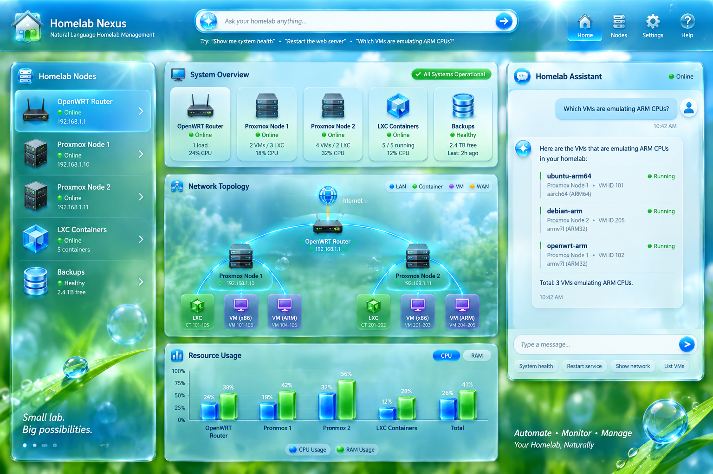
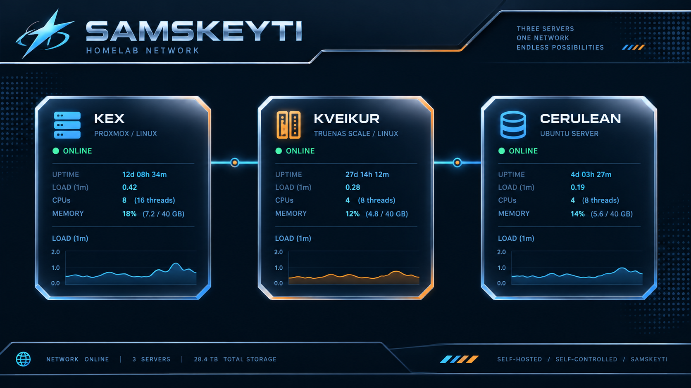

# SEIS 606 HW2: App Specs
## Natural Language Homelab & Inventory Management
I decided to pick a mix of my first two ideas: the NLP Homelab Management dashboard that can _also_ manage my inventory of parts. This project could probably just be a CLI, but I want to create something visually appealing and easy to maintain / expand. It will serve as a one-stop-shop for my many machines and containers, as well as other relevant projects. Given the amount of tinkering I do with my machines, I consider the inventory feature relevant and not just tacking on a separate app.

I wrote the majority of this text myself, however I utilized AI to rephrase my example queries from [HW1](../hw1/app-ideas.md) into statements. I also used it to migrate bullet points between sections if they were more appropriate in, for example, _Behavior_ instead of _Objectives_.

## MVP
Dashboard that aggregates system status from all Proxmox nodes. The MVP won't include the inventory system.

## Objectives
<!-- OBJECTIVE: the failure mode, not the feature description -->
- Prevent the classic "I forgot where I put that part" scenario
- Current debugging requires cross-referencing many different CLIs and tools, which is time-consuming and error-prone
- Some errors can go unnoticed for a while if not manually checked
- The app must reduce operational drift by aggregating my networked nodes, containers, and inventory into one view instead of requiring separate tools for each system
- The app must minimize the risk of destructive mistakes by requiring confirmation before running dangerous actions and by validating the affected systems before making changes

## Behavior
<!-- BEHAVIOR: observable outcomes only, no tech details -->
- Answer questions using available MCPs and context; given "which VMs are emulating ARM CPUs," it should provide a list of relevant VMs
- The system queries networked MCPs and summarizes each node in a single dashboard, including status, architecture, container health, and connection quality
- The app can create LXC containers from the appropriate template, restore a container from a chosen backup, and prune unnecessary backups while preserving the most recent ones
- The dashboard can identify container and VM health issues, including restart loops and repeated failures, and notify me when a safe remediation path is available. If the change is part of a user-defined list of "allowed actions," it can be applied automatically
- The app can compare node and container state against expected configurations, including checking whether a container is pinned to the latest Ubuntu LTS release or whether a system is running an ARM-emulating VM
- The system tracks inventory items such as tools, hardware, and consumables; it can add new parts, locate existing ones, and update quantities when items are used or purchased
  - NOTE: this requires an accurate and up-to-date inventory of everything and locations, which would be a one-time cost
- Inventory records support common operations such as decrementing or incrementing stock counts, appending items to shopping lists via the TickTick MCP, and searching by category, size, or location
- The app supports natural-language management tasks such as LXC rollback, backup cleanup, and other Proxmox actions through the relevant MCP interfaces without exposing raw terminal commands to the user
- Don't perform any dangerous/destructive commands without user input
- Minimal hallucination; if it is unsure about something, it should not make assumptions. If it could benefit from an MCP that exists on the web but isn't implemented locally, it will suggest I set it up
- Allow users to attach items to nodes themselves, creating a record of which parts are used where, not just what's available for use

## Constraints
<!-- CONSTRAINTS: non-negotiables regardless of implementation -->
- Keep operations atomic, especially those that modify system state / configs
- Avoid making assumptions, and double-check existing context and available MCPs before taking any action
- Prefer existing tools (e.g. ZFS MCP) over implementing new ones from scratch
- Ensure all actions are reversible or have a clear rollback procedure
- Provide cell blocks that can be copied & pasted all at once
- Display information about existing nodes in a concise and interpretable format
- Ensure that dynamic elements are programmatically defined, e.g. automatically retrieving IPs instead of hardcoding them
- Don't log secrets to the UI
- Must work behind a reverse proxy (Caddy)
- The UI must be responsive
- The frontend should use Streamlit as the default implementation unless a custom HTML/CSS layer is required for a specific design need; in either case, the interface must stay maintainable and practical rather than over-engineered
- Discord webhook for actions
  - Proxmox supports this natively, but other MCPs and tools might need custom integration
- The app should prioritize existing MCP implementations such as Proxmox, ZFS, Thunderbird, and Klipper before creating/suggesting custom tooling for the same problem

## Verification
<!-- VERIFICATION: testable criteria, not subjective ones -->
- Ditto on the "Which VMs are emulating ARM CPUs" question; for verification, confirm that the system correctly lists all relevant VMs and their architectures
- The system should proactively check the status of awry containers and alert me if intervention is needed. This could be achieved by manually breaking something
- If a node is offline, check its connection often (i.e. attempt to reconnect) and display its status in the UI
- Given "delete all but the latest backup for Ubuntu Stonking Stingray" containers should only remove backups for said containers. It must check each container's version with a quick `pct enter <container_id>` instead of assuming
- The app must correctly summarize each node using data from the configured MCPs, including status, health, architecture, and connection metrics, and render that summary in the frontend without manually hardcoded values
- The app must be able to perform a natural-language management action such as LXC rollback or backup cleanup through the relevant backend integration and report success or failure without modifying unrelated systems
- The inventory feature must correctly update counts for items such as computer fans, allen wrenches, screws, and zip ties when the user adds, uses, or purchases them
- Inventory queries must return the correct item set and quantity totals when searching by type, size, or location; for example, the system should show whether a specific screw or wrench is present before suggesting a purchase
- The app must distinguish between container-management actions and inventory actions so that a backup, restore, or version pin does not affect unrelated records
- The interface must remain functional behind a reverse proxy and continue to display the correct data when nodes or container counts change over time

## Visual Concepts
I tried generating mockups using local models in [image-generation.ipynb](image-generation.ipynb), but this proved to be challenging, and text was always illegible. I got better results from Perplexity and whichever image-generation models it calls on the backend.

I'm going for a Y2K aesthetic. Even though though the following examples may differ greatly in style, I imagine the final app will look like a combination of them. If I can't balance functionality with design, then I'd prefer a utilitarian approach that prioritizes density.

### Frutiger Aero (Perplexity)
This seems easy to expand and interpret at a glance. I'd be interested in programmatically building the topology instead of hardcoding it.

### Y2K (Perplexity)
This one is a banger, but it seems easy to overcomplicate. I want an app that's easy to maintain, so that means modular, reusable components and programmatic design choices (e.g. automatically retrieving IPs instead of hardcoding them).

### Y2K Minimal (Perplexity)
This looks clean, but I question how useful it'd be. It also has corny slogans that I don't want. I can foresee this being a panel as part of a bigger page. I'd use circles / progress bars for quick visual validation of load, and I wouldn't bother adding CPU count or uptime.

