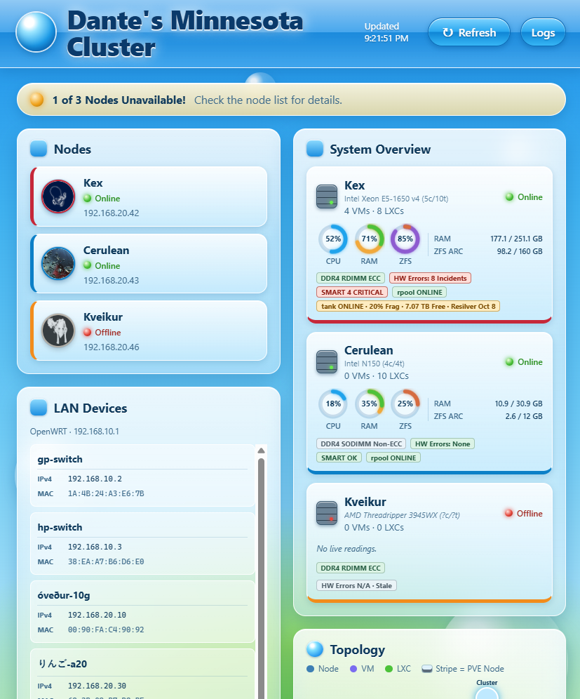

# SEIS 606 Homework 4: Testing, Testing...
Dante Razo, <razo3843@stthomas.edu>, FA26

## Report on Week 3 Testing
As of week 3's class, the app might as well not have existed. The web page was blank and despite the large amount of tokens Copilot used, it failed to generate anything tangible. I will have to be more careful about reviewing output in future iterations. When testing my small group's apps, I also saw how much the first screen matters. A feature does not count for much if you cannot tell whether it loaded or what it is showing. This time I ran the app and checked the page itself, not just whether code had been generated. The blank page is gone, but it was a good reminder to verify what a user actually sees.

## Recent Modifications
The difference since week 3 is night and day. The dashboard works, looks how I want it to, and is relatively easy to add features to (i.e. maintainable).

Unfortunately for the purposes of HW4, I didn't make dramatic changes to the spec to get past that hurdle. All I did was acknowledge that *Streamlit* is probably not the right tool for the job, and instead asked for standard HTML / CSS / JS for the web UI. I kept Python as the backend for handling API requests from the UI, and for data aggregation from the servers. After that, Copilot worked its magic a whole lot better than it did before.

With the exception of the inventory management feature, I think the web UI is close to what I envisioned originally. I look forward to what more I can refine before the project's due date.

## Dashboard Screenshots
These are screenshots of the running dashboard. Making this site publicly accessible sounds like a security nightmare given the level of access the backend has into my network, so it's local-only for now. I utilized AI to generate accessibility captions for each image.

### Dashboard Overview
As seen on my 16:9 1440p display:

The site resizes for mobile devices as well:

### Dynamic Cluster Topology
This panel displays the topology of my PVE nodes. Each node's containers are visible below them. When a node is connected, its dotted line will turn thicker and sport the associated color.

### VM and Container View
This section allows me to filter and search through my virtual machines and containers. By default, it shows all guests across all nodes. Filters allow me to quickly locate specific guests and view their status across different nodes.

### Network DHCP
This panel shows the DHCP leases for devices on my local network. Below is a clip of the guests on my IoT and Guest VLANs. I filter the lists between two different panels.

### Node and Hardware Health
I tried to make these system summary cards dense yet easy to read at a glance. Each server's CPU usage, RAM usage, and ZFS pool usage are displayed as prominent circles / meters. Specific values for RAM and ZFS ARC (also RAM) usage are shown to the right. Underneath are colored cards that highlight hardware errors, SMART status, and other critical alerts. These were inspired by me fighting every server except one over the last week and a half.

My main server, Kex, suffered hardware failures and I wanted to proactively catch them next time. Clicking on the *HW Errors* badge opens a detailed view of recent incidents in a modal. The background is blurred for greater visual separation.

Scrolling down gives you a table of incidents. Summaries are useful, but knowing specific errors is crucial for debugging.

Clicking on the *SMART* badge opens a modal displaying the health status of my storage devices, in additional to the pools they belong. Funny enough, this identified overheating drives that I wouldn't have noticed otherwise.

### Activity Logging
This modal displays recent web UI activity, including requests made to the dashboard and actions taken by users. I figured repeating the nodes' logs themselves would be redundant, though that might be a feature in a future version.

### Dashboard Styling
Originally, this card was here to fill in blank space. Now, that's less of an issue, but I decided to keep it anyway. The world needs more whimsy and I'll start by adding that to my dashboard.

The UI's header used to have a second line with a silly slogan. I've since consolidated that header element, but the slogan went too hard to throw away forever. I moved it to the bottom-right corner, where my favorite command-line utility *cowsay* now displays it. It can be seen below.

I included more than just the cow in this screenshot to highlight the background details and Frutiger Aero-inspired bubble graphics.
