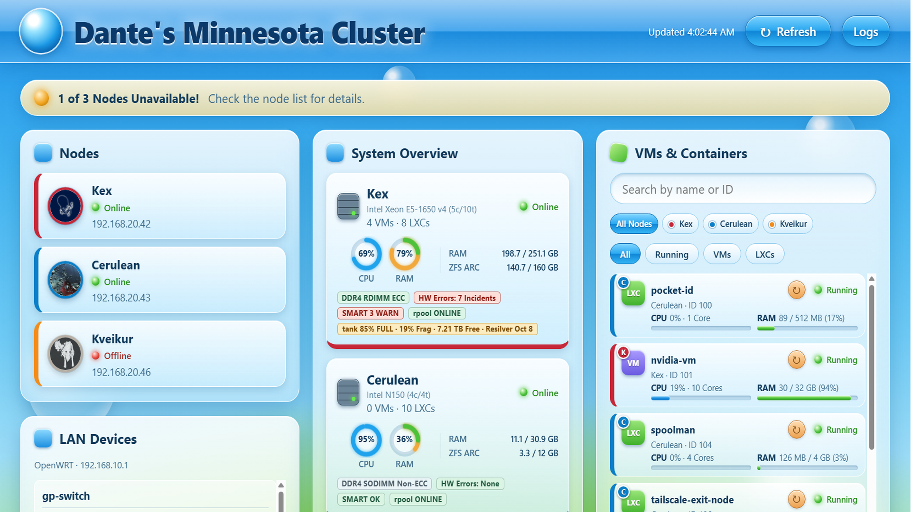
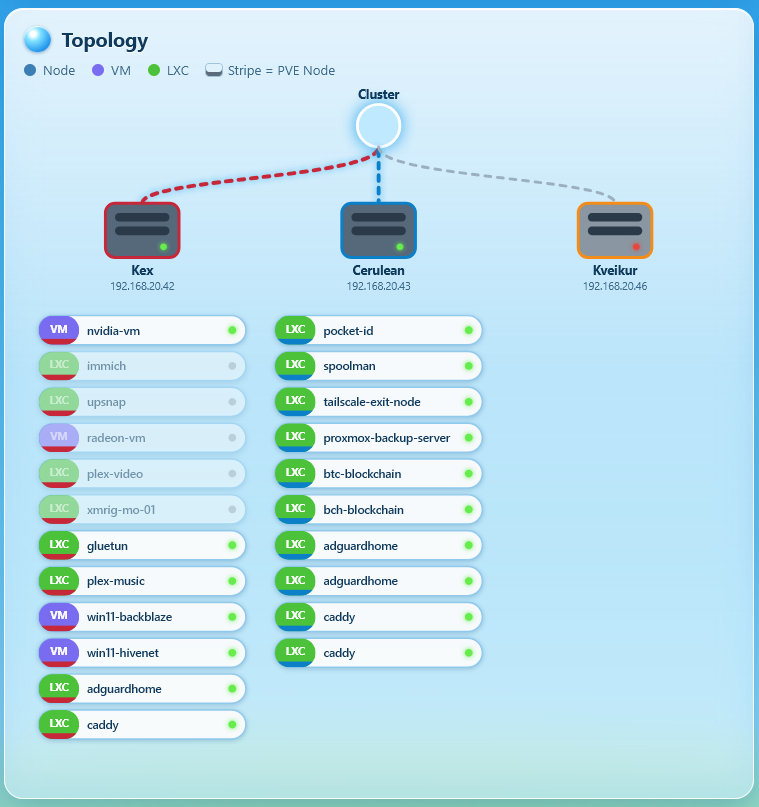
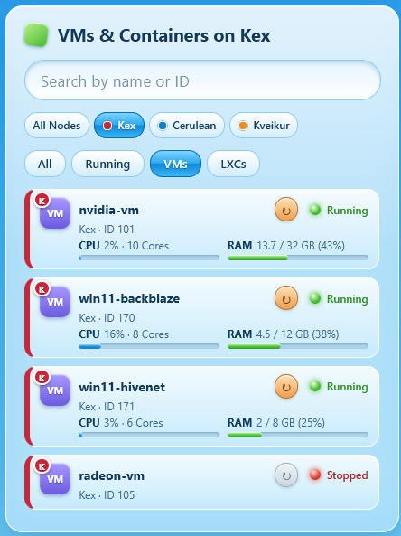
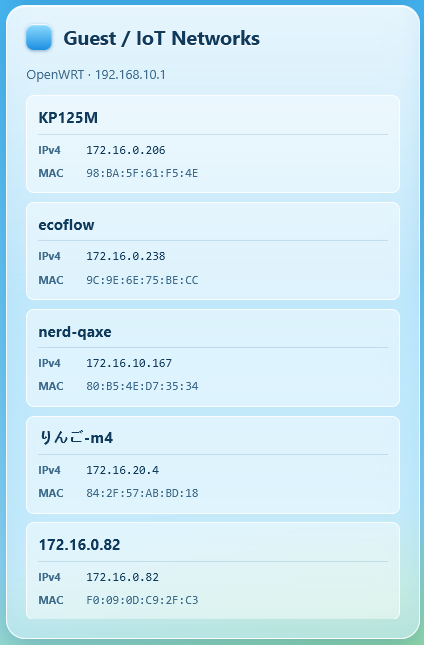
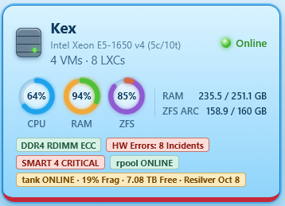
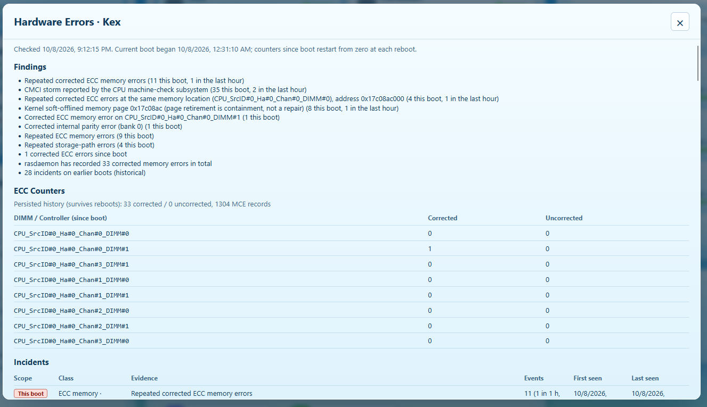
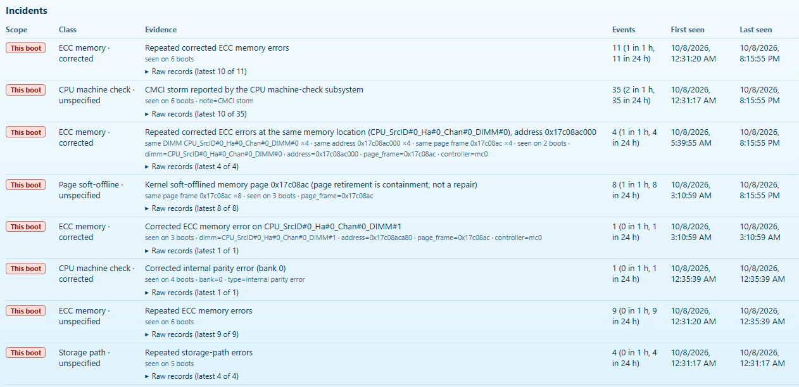
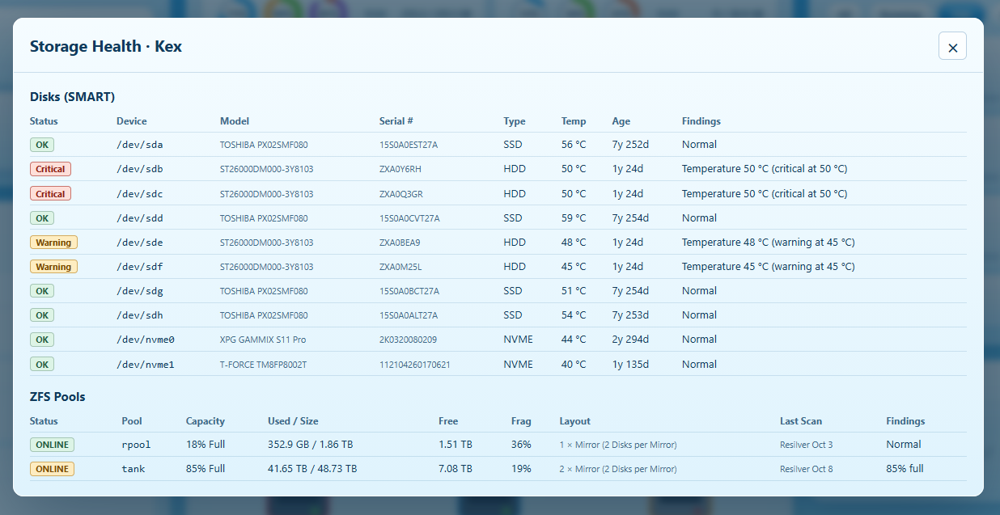
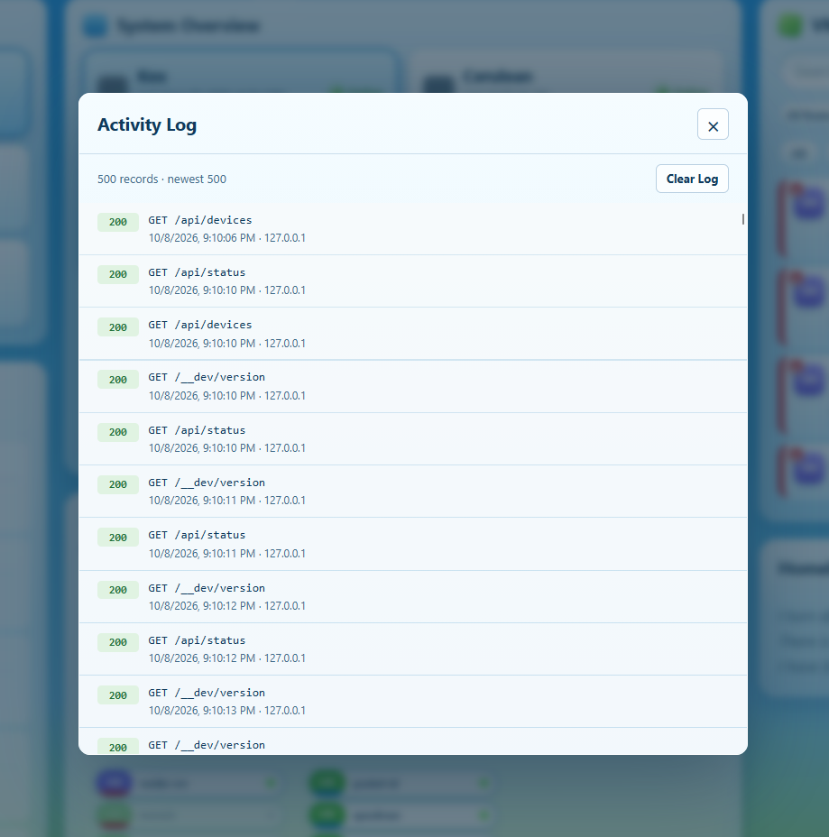
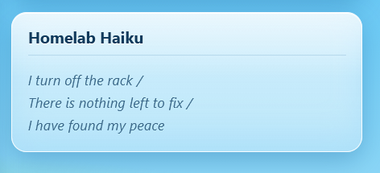

# SEIS 606 Homework 4: Testing, Testing...
Dante Razo, <razo3843@stthomas.edu>, FA26

## Report on Week 3 Testing
As of week 3's class, the app might as well not have existed. The web page was blank and despite the large amount of tokens Copilot used, it failed to generate anything tangible. I will have to be more careful about reviewing output in future iterations. When testing my small group's apps, I also saw how much the first screen matters. A feature does not count for much if you cannot tell whether it loaded or what it is showing. This time I ran the app and checked the page itself, not just whether code had been generated. The blank page is gone, but it was a good reminder to verify what a user actually sees.

## Recent Modifications
The difference since week 3 is night and day. The dashboard works, looks how I want it to, and is relatively easy to add features to (i.e. maintainable).

Unfortunately for the purposes of HW4, I didn't make dramatic changes to the spec to get past that hurdle. All I did was acknowledge that *Streamlit* is probably not the right tool for the job, and instead asked for standard HTML / CSS / JS for the web UI. I kept Python as the backend for handling API requests from the UI, and for data aggregation from the servers. After that, Copilot worked its magic a whole lot better than it did before. With the exception of the inventory management feature, I think the web UI is close to what I envisioned originally. I look forward to what more I can refine before the project's due date.

Immediately after week 4's class, I added logging functionality for the app itself. I figured logging my nodes themselves would be redundant.

## Dashboard Screenshots
These are screenshots of the running dashboard. Making this site publicly accessible sounds like a security nightmare given the level of access the backend has into my network, so it's local-only for now. I utilized AI to generate accessibility captions for each image.

### Dashboard Overview

### Cluster Topology

### Guest and Network Views

### Node and Hardware Health

### Activity Logging

### Dashboard Styling

